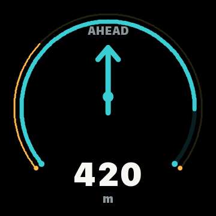
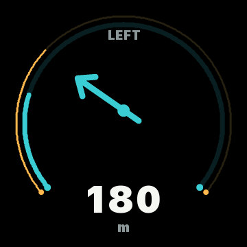
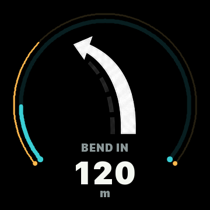
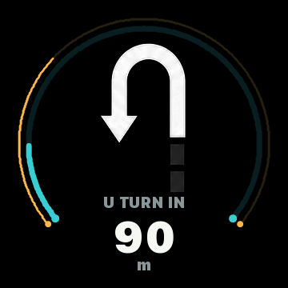
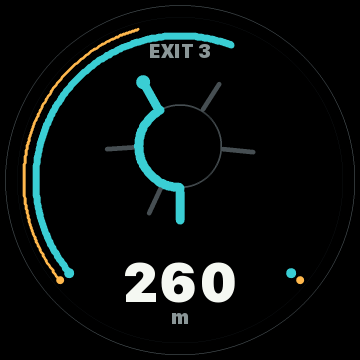
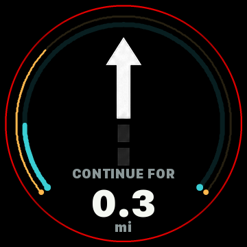
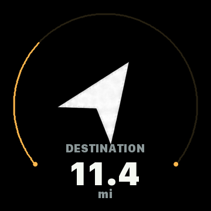

[](https://twitter.com/deanthecoder)
[](https://github.com/deanthecoder/SteedPilot/stargazers)

# SteedPilot
Motorcycle navigation companion powered by iPhone + ESP32 with a clean circular HUD-style display.

## Vision
SteedPilot is a compact motorcycle navigation companion inspired by minimalist devices such as the Beeline Moto II.

The goal is to create a clean, glanceable circular display mounted on a motorcycle handlebar, with an iPhone acting as the primary navigation and routing device.

Rather than rendering full maps on the device itself, SteedPilot focuses on:

- Clear turn-by-turn directions.
- Ride information.
- Minimal rider distraction.
- Fast interaction and readability.
- Compact, premium-looking hardware.

The project aims to feel more like a purpose-built instrument than a tiny computer.

## Core Architecture
SteedPilot is intentionally split into two parts:

### iPhone App
The iPhone app acts as the "brain" of the system.

Responsibilities include:

- Route planning.
- GPS tracking.
- Navigation state.
- Speed limit lookup.
- Heading and destination information.
- BLE communication with the display device.

### ESP32 Device
The ESP32 device acts as a low-power remote display and sensor platform.

Responsibilities include:

- Rendering the circular UI.
- Receiving navigation and telemetry data over BLE.
- Power management.
- Motion detection and wake/sleep behaviour.
- Optional ride telemetry using the onboard IMU.

The embedded device should remain intentionally lightweight and focused.

## Hardware
The initial prototype hardware is based around:

- Waveshare ESP32-S3 1.85" Touch Display Development Board.
- 360x360 circular IPS display.
- ESP32-S3 dual-core processor.
- BLE + WiFi.
- Integrated accelerometer + gyroscope.
- Battery charging support.
- Capacitive touch input.

The long-term goal is a compact, battery-powered device suitable for motorcycle handlebar mounting.

## Planned Modes
SteedPilot is expected to support multiple display modes:

- Navigation.
- Ride information.
- Destination heading.
- Ride summary.

The UI should remain clean and glanceable at all times.

Destination heading mode is not intended to be a traditional NSEW compass. It should show a clear arrow pointing toward the destination, plus a remaining-distance indicator.

Distances should be formatted for the rider's selected preference. The initial default is miles for longer distances and meters for shorter distances, with app settings planned for alternatives such as miles/feet and kilometers/meters.

Speed limit warnings should avoid adding another text readout. When current speed exceeds the limit supplied by the phone, the display can show a red circular edge warning that fades from subtle to fully opaque between the speed limit and speed limit + 5 in the rider's selected speed unit.

Navigation maneuvers should support more nuance than simple left/right turns. Planned maneuver data includes slight left/right, standard left/right, sharp left/right, roundabout, and roundabout exit number such as "exit 3". If the phone can provide roundabout exit count as well as the target exit, the device can draw a schematic roundabout with non-target exits muted and the desired exit highlighted.

Route progress can be shown with edge arcs inside the speed warning ring. The trip arc grows toward 100% as the route is completed, while the next-maneuver arc shrinks from 100% to 0% as the upcoming instruction approaches. Long stretches without a near maneuver may use a "stay on this road" style state rather than presenting an unhelpfully distant turn.

When the destination is reached, the device should switch to a ride-summary screen rather than staying in turn-by-turn mode. A small pair of chequered flags would be a good visual cue for arrival.

## UI Direction
The interface should favour:

- Large readable typography.
- High contrast.
- Minimal clutter.
- Smooth animations.
- Circular/radial UI elements.
- Touch-friendly interactions.

The design should feel modern and instrument-like rather than retro or novelty themed.

## Simulator Screens
The desktop simulator can export reference screenshots for README updates and visual review:

```sh
./sim/build/steedpilot-sim --export-screenshots
```

Render a single JSON fixture in the simulator:

```sh
./sim/build/steedpilot-sim --fixture fixtures/navigation-roundabout.json
```

Export a single fixture to PNG:

```sh
./sim/build/steedpilot-sim --export-fixture fixtures/navigation-roundabout.json --output /tmp/roundabout.png
```

Replay a short BLE route sequence to the device:

```sh
tools/steedpilot_send --replay fixtures/route-demo.json
```










## Font Assets
The simulator uses a generated anti-aliased single-channel font atlas that can also be consumed by the ESP32 firmware renderer.

Regenerate the atlas after changing the source font, character set, or fixed text sizes:

```sh
python3 tools/generate_font_atlas.py
```

The generator writes:

- `include/SteedPilot/FontAtlas.h`
- `src/generated/FontAtlas.c`

## Interaction Model
The device is expected to primarily use capacitive touch input.

Interactions should be designed around:

- Large touch regions.
- Long-press gestures.
- Simple mode switching.
- Minimal interaction while riding.

The UI should remain stable and resistant to accidental input caused by vibration.

## iOS App
An initial SwiftUI fixture-sender app lives in `ios/SteedPilot`.

Open it in Xcode:

```sh
open ios/SteedPilot/SteedPilot.xcodeproj
```

The first scaffold scans for the `SteedPilot` BLE service and sends built-in `state`, `update`, and `heartbeat` packets to the ESP32. Run it on a physical iPhone for live BLE testing; the iOS simulator is useful for UI layout only.

## Development Approach
A desktop simulator will be used for rapid UI iteration and development.

The simulator should allow:

- Rendering the circular UI on desktop.
- Simulating navigation state.
- Simulating BLE packets.
- Testing touch interactions.
- Iterating quickly without repeatedly flashing hardware.

The ESP32 firmware and desktop simulator should share as much rendering and state-management logic as possible.

## BLE Fixture Loop
The first live-device development loop uses JSON fixtures as the protocol source of truth.

Protocol details are documented in [docs/protocol.md](docs/protocol.md).

The firmware advertises a `SteedPilot` BLE peripheral with one writable navigation-state characteristic. A Mac can send any fixture directly to the ESP32:

```sh
tools/steedpilot_send fixtures/navigation-roundabout.json
```

The sender chunks the JSON over BLE and terminates each packet with a newline. The ESP32 buffers the chunks, parses the complete JSON packet, and immediately renders the resulting `NavState`.

Packets can be sent as full state, partial update, or heartbeat messages:

```json
{ "v": 1, "type": "state", "mode": "navigation", "maneuver": "turnLeft" }
```

```json
{ "v": 1, "type": "update", "distanceToManeuverMeters": 178, "speed": { "current": 42 } }
```

```json
{ "v": 1, "type": "heartbeat" }
```

`state` replaces the device navigation state, `update` patches only the fields present, and `heartbeat` refreshes the no-phone timeout. Before a route is active, heartbeat tells the device the app is alive so it can move from `LAUNCH APP` to `SET ROUTE`.

The current live-device lifecycle is:

- Device boot: `LAUNCH APP`.
- App connected with no route: `SET ROUTE`.
- Route state received: render navigation.
- Phone lost after route state: `NO PHONE`.
- Heartbeat returns after route state: restore the last navigation screen.

Roundabout fixtures can include relative exit angles so the device can draw exits closer to real life:

```json
{
  "maneuver": "roundabout",
  "roundabout": {
    "exit": 3,
    "exitCount": 5,
    "exits": [
      { "index": 1, "angleDegrees": -105 },
      { "index": 2, "angleDegrees": -20 },
      { "index": 3, "angleDegrees": 35 }
    ]
  }
}
```

## Project Principles
- No full map rendering on the device.
- The iPhone handles the complex logic.
- The device should boot and wake quickly.
- The UI should be readable in bright daylight.
- Minimal rider distraction is a priority.
- Keep the embedded side simple and reliable.

## Status
Early planning and prototyping.

# Notes
- I'd like to support offline usage, if possible.
- We should ideally allow route recalculation.
- Think about traffic reporting.
- Must support route planning that avoids motorways. (I only have CBT license)
- When destination is reached, show route summary. Time, distance, average speed(?), times speed limit was exceeded
